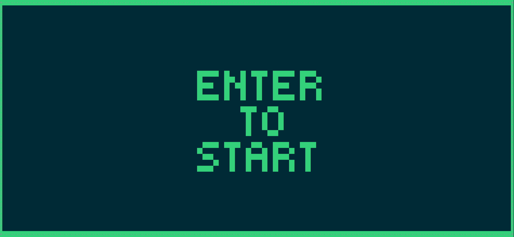

# Pong in Bash

Why do we Pong in Bash? We choose to Pong in Bash and do other things
not because they are easy, but because they are hard! 🚀



## Usage
Fastest way to get the game running would be:  <br />
```bash <(curl https://raw.githubusercontent.com/LucasOpoka/Bash-Pong/refs/heads/main/pong.sh)```

## Controls
Left paddle: W/S <br />
Right paddle: O/L <br />
Quite game: Q
